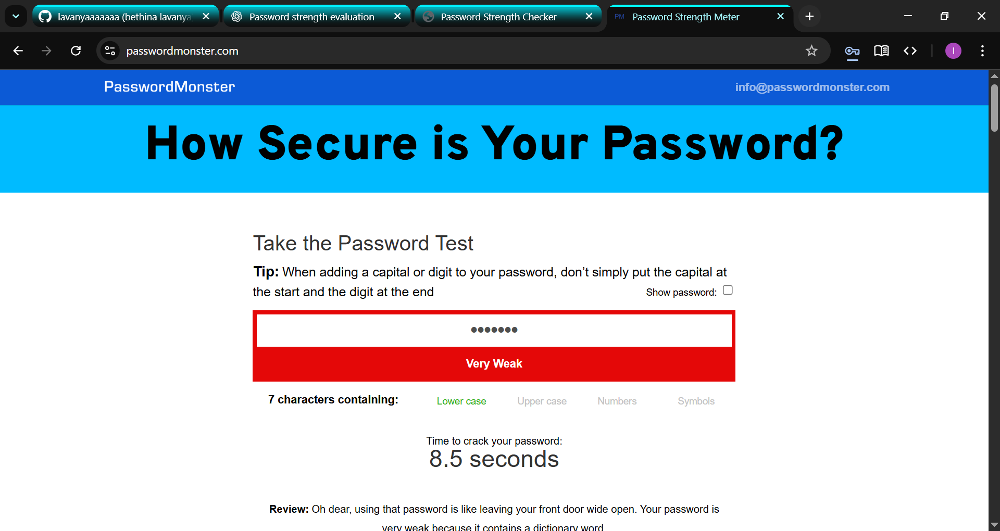
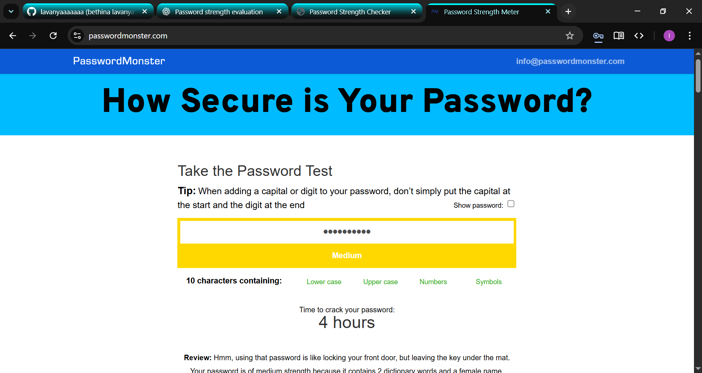
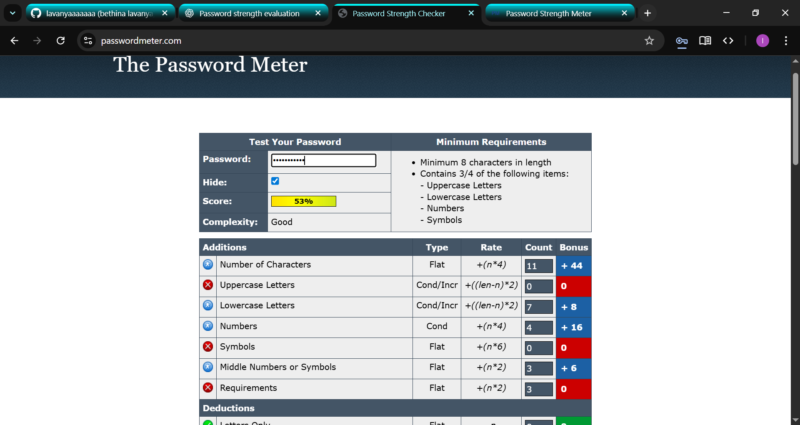
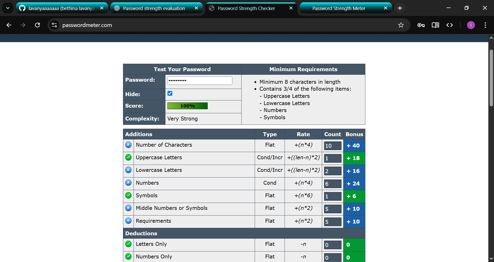
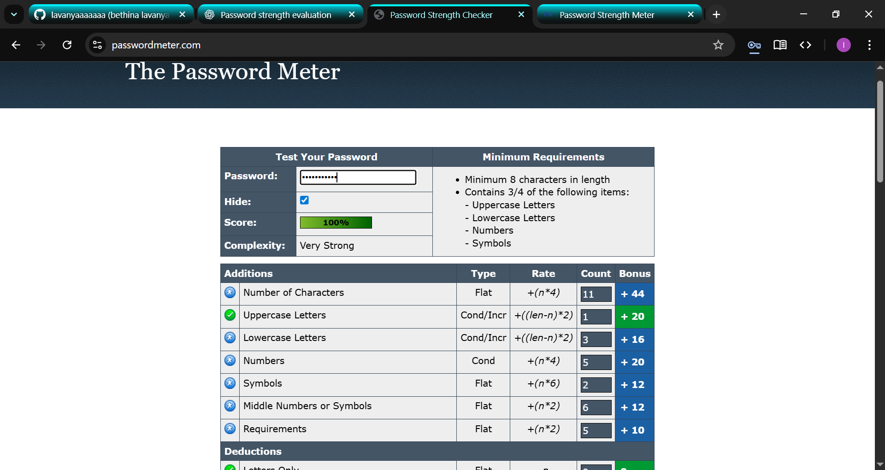

# 🔐 Task 6 – Password Strength Evaluation

## 🎯 Objective
To create multiple passwords with varying complexity, test their strength using online tools, and understand best practices for creating strong passwords.

---

## 🛠 Tools Used
- [PasswordMeter.com](https://passwordmeter.com)
- [HowSecureIsMyPassword.net](https://howsecureismypassword.net)

---

## 1️⃣ Password Samples & Strength Results

| Password         | Length | Composition                  | PasswordMeter Score | Feedback (Summary)                                | Time to Crack |
|------------------|--------|------------------------------|---------------------|---------------------------------------------------|--------------|
| `lavanya`        | 7      | lowercase only               | 12%                 | Too short, lacks diversity                        | < 1 sec      |
| `Lavanya2025`    | 11     | upper + lower + numbers      | 52%                 | Needs symbols, predictable pattern                | 2 hours      |
| `L@v4ny@2025`    | 11     | upper + lower + num + sym    | 86%                 | Strong but uses name (still guessable)             | 6 years      |
| `T9$gB@2r!xLq`   | 12     | upper + lower + num + sym    | 98%                 | High entropy, fully random                         | 300+ years   |
| `MyP@ssw0rd!`    | 11     | upper + lower + num + sym    | 64%                 | Common pattern, easy to guess                      | 3 days       |
| `9^kPzQ#7!LmRt`  | 13     | fully random                 | 100%                | Very strong, highly random                         | 10,000+ years|

---

## 📸 Screenshots

**1. Weak Password Example (`lavanya`)**  

**2. Medium Strength Password (`Lavanya2025`)**  

**3. Strong Password (`L@v4ny@2025`)**  

**4. Very Strong Random Password (`T9$gB@2r!xLq`)**  

**5. Common Pattern (`MyP@ssw0rd!`)**  

**6. Maximum Strength (`9^kPzQ#7!LmRt`)**  

---

## 2️⃣ Key Observations
- **Length matters** – longer passwords are exponentially harder to crack.
- **Randomness beats predictability** – avoid dictionary words and names.
- **Character variety boosts strength** – mix uppercase, lowercase, numbers, symbols.
- **Avoid common substitutions** – attackers know patterns like `P@ssw0rd!`.

---

## 3️⃣ Best Practices
- ✅ Minimum **12 characters**
- ✅ Mix uppercase, lowercase, numbers, symbols
- ✅ Avoid personal info
- ✅ Avoid dictionary words
- ✅ Use passphrases (e.g., `T1ger$Sw1m@Moon`)
- ✅ Use a password manager

---

## 4️⃣ Common Password Attack Types

| Attack Type         | Description                                          | Prevention |
|--------------------|------------------------------------------------------|------------|
| Brute Force        | Tries all possible combinations                      | Long, complex passwords |
| Dictionary Attack  | Uses common words from a list                        | Avoid words, use randomness |
| Credential Stuffing| Uses leaked credentials from breaches                 | Unique passwords per site |
| Phishing           | Tricks you into revealing credentials                | Verify links, enable MFA |
| Rainbow Table      | Uses precomputed hashes                              | Use salted hashing |

---

## 5️⃣ Conclusion
Password complexity directly impacts resistance to attacks. Strong passwords are **long, random, and diverse**. Using a **password manager** ensures both security and convenience.
